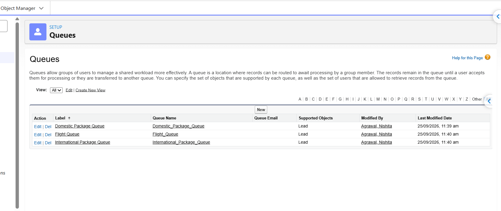

# Segment 1 – Capture and Route Travel Enquiries

## What I worked on

In this segment, I started building the lead management part of the TravelMate Salesforce application.

The requirement was to capture travel enquiry details such as the type of enquiry, destination, travel dates, number of travellers and estimated budget.

I used the standard Salesforce Lead object and added custom fields according to the project requirements.

## Lead Fields Added

### Basic Information

- Enquiry Type – Picklist
- Origin City – Text
- Destination – Text
- Departure Date – Date
- Return Date – Date
- Adults – Number
- Children – Number
- Estimated Budget – Currency
- Passport Available – Checkbox

### Formula Fields

- Total Travellers
- Travel Duration
- Enquiry Priority

## Formula Logic

### Total Travellers

Total Travellers is calculated using the number of adults and children.

`Adults + Children`

For example, if there are 2 adults and 1 child, the total traveller count is 3.

### Travel Duration

Travel duration is calculated using the departure and return dates.

`Return Date - Departure Date + 1`

The `+1` is used because both the departure and return dates are included in the travel duration.

### Enquiry Priority

The enquiry priority is calculated from the estimated budget:

- ₹2,00,000 or above → Hot
- ₹75,000 to below ₹2,00,000 → Warm
- Below ₹75,000 → Standard
- Blank budget → Blank

## Testing

I created test Lead records to verify that the formula fields were calculating the expected values.

For example:

- 2 Adults + 1 Child → 3 Total Travellers
- 10 Oct to 14 Oct → 5 Days
- ₹2,00,000 Budget → Hot Priority

## Salesforce Concepts Practiced

- Custom Fields
- Picklist
- Number and Currency Fields
- Checkbox
- Formula Fields
- Formula Return Types
- Basic Lead Data Management

## Lead Queues

I created three Lead queues to separate travel enquiries based on the type of enquiry.

### Queues Created

- Domestic Package Queue
- International Package Queue
- Flight Queue

All three queues are configured to work with the Lead object.

These queues will be used with the Lead Assignment Rule to route new enquiries to the appropriate team.

### Queue Setup

## Lead Assignment Rule

After creating the queues, I configured a Lead Assignment Rule to automatically route enquiries based on the selected Enquiry Type.

### Routing Logic

| Enquiry Type | Assigned Queue |
|---|---|
| International Package | International Package Queue |
| Domestic Package | Domestic Package Queue |
| Flight Only | Flight Queue |

The International Package rule is placed first, followed by Domestic Package and Flight Only.

### Testing

I created test Leads for all three enquiry types and checked the Lead Owner after saving.

- International Package → International Package Queue
- Domestic Package → Domestic Package Queue
- Flight Only → Flight Queue

The Assignment Rule successfully routed the test Leads to the expected queues.

### Assignment Rule Setup

### International Lead Routing

### Domestic Lead Routing

### Flight Lead Routing

## Web-to-Lead Form

To capture travel enquiries from the website, I created a Salesforce Web-to-Lead form for TravelMate.

The form captures:

- Customer information such as Name, Email and Phone
- Enquiry Type
- Origin City and Destination
- Departure and Return Date
- Number of Adults and Children
- Estimated Budget
- Passport Availability

The form submits the enquiry directly to Salesforce as a Lead.

I also tested the form with different enquiry types and validation scenarios to verify that the data is captured correctly and routed through the Lead Assignment Rule.
-------------------------------------
### Live Demo

The Web-to-Lead form is hosted using GitHub Pages:

**[Live Travel Enquiry Form](https://nishita1428.github.io/TravelMate-Salesforce-Admin-Project/)**
------------------------------------------

